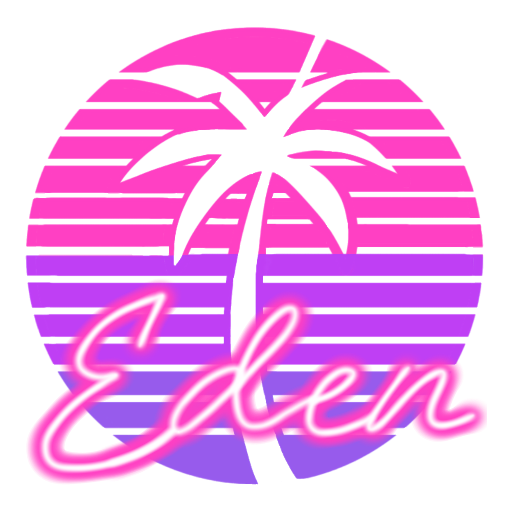

<!--
# SPDX-FileCopyrightText: Copyright 2025 Eden Emulator Project
# SPDX-License-Identifier: GPL-3.0-or-later

# SPDX-FileCopyrightText: 2018 yuzu Emulator Project
# SPDX-License-Identifier: GPL-2.0-or-later
-->
<!-- lang: en-GB -->

<h1 align="center">
   
  
   
  <b>Eden</b>
   
</h1>

<h4 align="center"><b>Eden</b> is an open-source Nintendo Switch emulator, forked from the Yuzu emulator — started by former Citron developer Camille LaVey and the Eden team.
It is written in C++ with portability in mind, and we actively maintain builds for Windows, Linux and Android.
</h4>

    </a>
    
    

  <a href="#compatibility">Compatibility</a> |
  <a href="#development">Development</a> |
  <a href="#building">Building</a> |
  <a href="#download">Download</a> |
  <a href="#support">Support</a> |
  <a href="#license">License</a>

## Compatibility

The emulator is capable of running most commercial games at full speed, provided you meet the necessary hardware requirements.

A list of supported games will be available in future. Please be patient.

Check out our [website](https://eden-emu.dev) for the latest news on exciting features, monthly progress reports, and more!

## Development

Most of the development happens on our Git server. It is also where [our central repository](https://git.eden-emu.dev/eden-emu/eden) is hosted. For development discussions, please join us on [Discord](https://discord.gg/HstXbPch7X) or [Revolt](https://rvlt.gg/qKgFEAbH).
You can also follow us on [X (Twitter)](https://nitter.poast.org/edenemuofficial) for updates and announcements.

If you would like to contribute, we are open to new developers and pull requests. Please ensure that your work is of a high standard and properly documented. You can also contact any of the developers on Discord or Revolt to learn more about the current state of the emulator.

See the [sign-up instructions](docs/SIGNUP.md) for information on registration.

Alternatively, if you wish to add translations, go to the [Eden project on Transifex](https://app.transifex.com/edenemu/eden-emulator) and review [the translations README](./dist/languages).

## Building

See the [General Build Guide](docs/Build.md)

For information on provided development tooling, see the [Tools directory](./tools)

## Download

You can download the latest releases from [here](https://github.com/eden-emulator/Releases/releases).

## Support

If you enjoy the project and would like to support us financially, please check out our developers' [donation pages](https://eden-emu.dev/donations)!

Any donations received will go towards things such as:
* Switch consoles to explore and reverse-engineer the hardware
* Switch games for testing, reverse-engineering, and implementing new features
* Web hosting and infrastructure setup
* Additional hardware (e.g. GPUs as needed to improve rendering support, other peripherals to add support for, etc.)
* CI Infrastructure

If you would prefer to support us in a different way, please join our [Discord](https://discord.gg/HstXbPch7X) and talk to Camille or any of our other developers.

## License

Eden is licensed under the GPLv3 (or any later version). Refer to the [LICENSE.txt](https://git.eden-emu.dev/eden-emu/eden/src/branch/master/LICENSE.txt) file.
