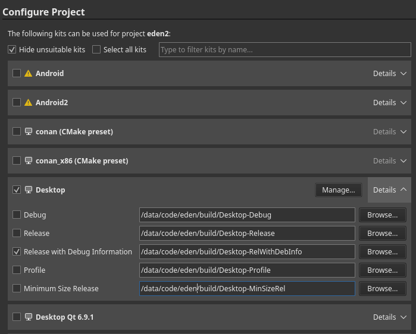

# Building Eden

> [!WARNING]
> This guide is intended for developers ONLY. If you are not a developer or packager, you are unlikely to receive support.

This is a full-fledged guide to build Eden on all supported platforms.

## Dependencies
First, you must [install some dependencies](Deps.md).

## Clone
Next, you will want to clone Eden via the terminal:

```sh
git clone https://git.eden-emu.dev/eden-emu/eden.git
cd eden
```

Or use Qt Creator (Create Project -> Import Project -> Git Clone).

## Android

Android has a completely different build process than other platforms. See its [dedicated page](build/Android.md).

## Initial Configuration

If the configure phase fails, see the `Troubleshooting` section below. Usually, as long as you followed the dependencies guide, the defaults *should* successfully configure and build.

### Option A: Qt Creator

This is the recommended GUI method for Linux, macOS, and Windows.

<details>
<summary>Click to Open</summary>

> [!WARNING]
> On MSYS2, to use Qt Creator you are recommended to *also* install Qt from the online installer, ensuring to select the "MinGW" version.

Open the CMakeLists.txt file in your cloned directory via File -> Open File or Project (Ctrl+O), if you didn't clone Eden via the project import tool.

Select your desired "kit" (usually, the default is okay). RelWithDebInfo or Release is recommended:



Hit "Configure Project", then wait for CMake to finish configuring (may take a while on Windows).

</details>

### Option B: Command Line

<details>
<summary>Click to Open</summary>

> [!WARNING]
>For all systems:
>- *CMake* **MUST** be in your PATH (and also *ninja*, if you are using it as `<GENERATOR>`)
>- You *MUST* be in the cloned *Eden* directory
>
>On Windows:
>  - It's recommended to install **[Ninja](https://ninja-build.org/)**
>  - You must load **Visual C++ development environment**, this can be done by running our convenience script:
>    - `tools/windows/load-msvc-env.ps1` (for PowerShell 5+)
>    - `tools/windows/load-msvc-env.sh` (for MSYS2, Git Bash, etc)

Available `<GENERATOR>`:
- MSYS2: `MSYS Makefiles`
- MSVC: `Ninja` (preferred) or `Visual Studio 17 2022`
- macOS: `Ninja` (preferred) or `Xcode`
- Others: `Ninja` (preferred) or `UNIX Makefiles`

Available `<BUILD_TYPE>`:
- `Release` (default)
- `RelWithDebInfo` (debug symbols--compiled executable will be large)
- `Debug` (if you are using a debugger and annoyed with stuff getting optimized out)

Caveat for Debug Builds:
- If you're building with CCache, you will need to add the environment variable `CL` with the `/FS` flag ([Reference](https://learn.microsoft.com/pt-br/cpp/build/reference/fs-force-synchronous-pdb-writes?view=msvc-170))

Also see the [Options](Options.md) page for additional CMake options.

```sh
cmake -S . -B build -G "<GENERATOR>" -DCMAKE_BUILD_TYPE=<BUILD_TYPE> -DYUZU_TESTS=OFF
```

If you are on Windows and prefer to use Clang:

```sh
cmake -S . -B build -G "<GENERATOR>" -DCMAKE_C_COMPILER=clang-cl -DCMAKE_CXX_COMPILER=clang-cl
```

</details>

### Option C: [CLion](https://www.jetbrains.com/clion/)

<details>
<summary>Click to Open</summary>

* Clone the Repository:


---

### Building & Setup

* Once Cloned, You will be taken to a prompt like the image below:


* Set the settings to the image below:
* Change `Build type: Release`
* Change `Name: Release`
* Change `Toolchain Visual Studio`
* Change `Generator: Let CMake decide`
* Change `Build directory: build`


* Click OK; now Clion will build a directory and index your code to allow for IntelliSense. Please be patient.
* Once this process has been completed (No loading bar bottom right), you can now build eden
* In the top right, click on the drop-down menu, select all configurations, then select eden


* Now run by clicking the play button or pressing Shift+F10, and eden will auto-launch once built.


</details>

## Troubleshooting

If your initial configure failed:
- *Carefully* re-read the [dependencies guide](Deps.md)
- Clear the CPM cache (`.cache/cpm`) and CMake cache (`<build directory>/CMakeCache.txt`)
- Evaluate the error and find any related settings
- See the [CPM docs](CPM.md) to see if you may need to forcefully bundle any packages

Otherwise, feel free to ask for help in Revolt or Discord.

## Caveats

Many platforms have quirks, bugs, and other fun stuff that may cause issues when building OR running. See the [Caveats page](Caveats.md) before continuing.

## Building & Running

### On Qt Creator

Simply hit Ctrl+B, or the "hammer" icon in the bottom left. To run, hit the "play" icon, or Ctrl+R.

### On Command Line

If you are using the `UNIX Makefiles` or `Visual Studio 17 2022` as `<GENERATOR>`, you should also add `--parallel` for faster build times.

```
cmake --build build
```

Your compiled executable will be in:
- `build/bin/eden.exe` for Windows,
- `build/bin/eden.app/Contents/MacOS/eden` for macOS,
- and `build/bin/eden` for others.

## Scripts

Some platforms have convenience scripts provided for building.

- **[Linux](scripts/Linux.md)**
- **[Windows](scripts/Windows.md)**

macOS scripts will come soon.
