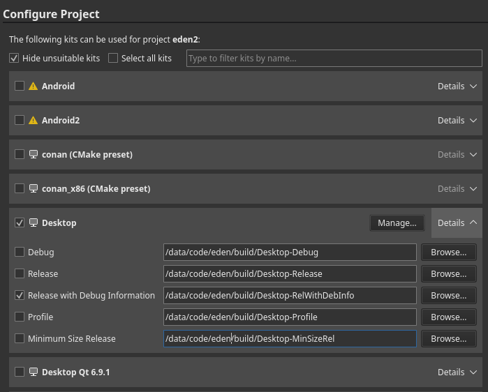

# Building Eden

> [!WARNING]
> This guide is intended for developers ONLY. If you are not a developer or packager, you are unlikely to receive support.

This is a full-fledged guide to build Eden on all supported platforms.

## Dependencies

First, you must [install some dependencies](Deps.md).

## Clone

Next, you will want to clone Eden via the terminal:

```sh
git clone https://git.eden-emu.dev/eden-emu/eden.git
cd eden
```

Or use Qt Creator (Create Project -> Import Project -> Git Clone).

## Android

Android has a completely different build process than other platforms. See its [dedicated page](build/Android.md).

## Initial Configuration

If the configure phase fails, see the `Troubleshooting` section below. Usually, as long as you followed the dependencies guide, the defaults *should* successfully configure and build.

### Option A: Qt Creator

This is the recommended GUI method for Linux, macOS, and Windows.

<details>
<summary>Click to Open</summary>

Open the CMakeLists.txt file in your cloned directory via File -> Open File or Project (Ctrl+O), if you didn't clone Eden via the project import tool.

Select your desired "kit" (usually, the default is okay). RelWithDebInfo or Release is recommended:



Hit "Configure Project", then wait for CMake to finish configuring (may take a while on Windows).

</details>

### Option B: Command Line

<details>
<summary>Click to Open</summary>

> [!WARNING]
>For all systems:
>
>- *CMake* **MUST** be in your PATH (and also *ninja*, if you are using it as `<GENERATOR>`)
>- You *MUST* be in the cloned *Eden* directory

Available `<GENERATOR>`:

- MSYS2: `Ninja`
- macOS: `Ninja` (preferred) or `Xcode`
- Others: `Ninja` (preferred) or `UNIX Makefiles`

Available `<BUILD_TYPE>`:

- `Release` (default)
- `RelWithDebInfo` (debug symbols--compiled executable will be large)
- `Debug` (if you are using a debugger and annoyed with stuff getting optimized out)

Also see the root CMakeLists.txt for more build options. Usually the default will provide the best experience.

```sh
cmake -S . -B build -G "<GENERATOR>" -DCMAKE_BUILD_TYPE=<BUILD_TYPE> -DYUZU_TESTS=OFF
```

</details>

## Troubleshooting

If your initial configure failed:

- *Carefully* re-read the [dependencies guide](Deps.md)
- Clear the CPM cache (`.cache/cpm`) and CMake cache (`<build directory>/CMakeCache.txt`)
- Evaluate the error and find any related settings
- See the [CPM docs](CPM.md) to see if you may need to forcefully bundle any packages

Otherwise, feel free to ask for help in Stoat or Discord.

## Caveats

Many platforms have quirks, bugs, and other fun stuff that may cause issues when building OR running. See the [Caveats page](Caveats.md) before continuing.

## Building & Running

### On Qt Creator

Simply hit Ctrl+B, or the "hammer" icon in the bottom left. To run, hit the "play" icon, or Ctrl+R.

### On Command Line

If you are using the `UNIX Makefiles` or `Visual Studio 17 2022` as `<GENERATOR>`, you should also add `--parallel` for faster build times.

```sh
cmake --build build
```

Your compiled executable will be in:

- `build/bin/eden.exe` for Windows,
- `build/bin/eden.app/Contents/MacOS/eden` for macOS,
- and `build/bin/eden` for others.

## Scripts

Take a look at our [CI scripts](https://github.com/Eden-CI/Workflow). You can use `.ci/common/configure.sh` on any POSIX-compliant shell, but you are heavily encouraged to instead write your own based. It's not really that hard, provided you can read CMake.
